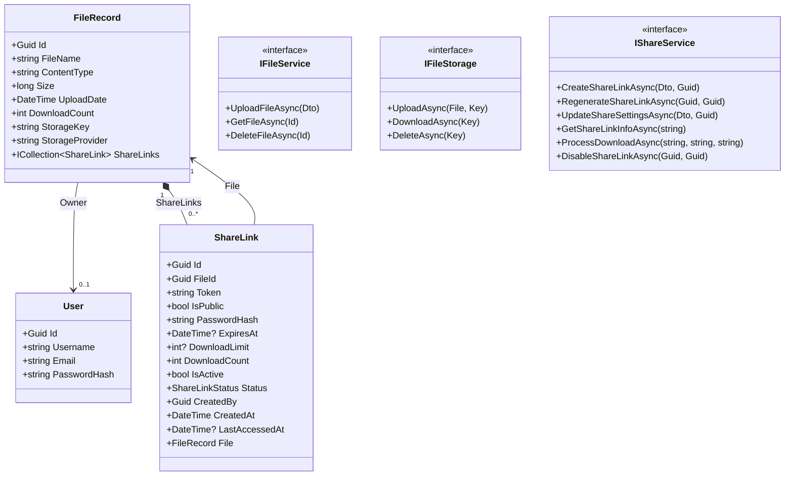

<div align="center">
  

  # Vaultix
  *A clean, file-first digital workspace and secure sharing platform*

  [](https://dotnet.microsoft.com)
  [](https://react.dev)
  [](https://vite.dev)
  [](https://tailwindcss.com)
  [](https://www.postgresql.org)

  ⭐ If you like this project, star it on GitHub!

  [Overview](#overview) • [Features](#features) • [Architecture](#architecture) • [Getting Started](#getting-started) • [API Documentation](#api-documentation) • [Production Deployment](#production-deployment)
</div>

---

## Overview

**Vaultix** is a premium, file-first digital workspace designed to keep the focus entirely on your content. Anchored on a clean, minimal design with elegant near-monochrome aesthetics and display typography, Vaultix prioritizes files, virtual directories, previews, and sharing workflows over complex administrative dashboards.

The platform consists of:
- **`FileShareAPI`**: A high-performance, robust REST API built with **ASP.NET Core Web API (.NET 10)**, using **Entity Framework Core** and **PostgreSQL** to manage metadata, and supporting local disk storage or AWS S3/Cloudflare R2 storage engines.
- **`client`**: A fluid, modern single-page frontend application crafted with **React 19**, **Vite**, **Tailwind CSS v4**, and **Framer Motion 12** for responsive layouts and premium micro-interactions.

> [!NOTE]
> This repository is a monorepo containing both the backend API and frontend client. Both services can be run locally or containerized for production deployment.

---

## Features

- 📁 **File-First Dashboard** — Navigate files, recent uploads, favorites, and shared resources in an intuitive personal workspace.
- 📂 **Client-Side Folder System** — Organize assets hierarchically by formatting paths with slashes. Group files dynamically into virtual folders.
- 📤 **Drag-and-Drop Uploads** — Easily upload files with progress indicators and instant visual feedback.
- 👁️ **Slide-Over Previews** — View images, PDF documents, and plain-text files natively inside a sliding panel without leaving the workspace.
- 🔗 **Secure File Sharing** — Share files publicly or privately with granular visibility, customizable settings, and live visual badges:
  - 🔑 **Password Protection** — Require secure access codes hashed using ASP.NET Identity's PasswordHasher.
  - ⏳ **Expiry Limits** — Automatically expire links after preset durations (e.g. 1 hour, 1 day, 7 days) or custom dates/times.
  - 🛑 **Download Constraints** — Cap download limits and track remaining accesses. Built-in concurrency control prevents race conditions.
  - 📱 **QR Code Sharing** — Generate and download custom QR codes as PNGs for immediate scanning.
- 🛡️ **JWT Authentication** — Secure user signup, login, and authorization to protect user assets.
- 📦 **Dual Storage Engines** — Automatically stores files on the local filesystem or easily routes them to Cloudflare R2 / AWS S3 storage buckets.

---

## Architecture

Vaultix uses a thin-controller API architecture. Business logic resides in dedicated services, while persistence is handled by Entity Framework Core. Below is a layout showing the service orchestration and database relationships.

### Directory Structure
```text
Vaultix/
├── FileShareAPI/       # ASP.NET Core 10 Web API backend
│   ├── Controllers/    # Thin HTTP endpoints (Auth, File operations, Share settings)
│   │   └── ShareController.cs
│   ├── Services/       # Business logic (JWT, Local/S3 storage engines, ShareService, AuditService)
│   │   ├── ShareService.cs
│   │   └── AuditService.cs
│   ├── Data/           # EF Core ApplicationDbContext and entity mappings
│   ├── Models/         # Database models (FileRecord, User, ShareLink, AuditLog)
│   │   ├── ShareLink.cs
│   │   └── AuditLog.cs
│   └── Migrations/     # Auto-generated database migrations
└── client/             # React 19 + Vite frontend
    ├── src/
    │   ├── components/ # Reusable UI controls (Card, Previews, ShareDrawer, ShareBadge)
    │   │   ├── ShareDrawer.jsx
    │   │   └── ShareBadge.jsx
    │   ├── pages/      # View layouts (LandingPage, FilesPage, PublicDownloadPage)
    │   │   └── PublicDownloadPage.jsx
    │   └── lib/        # API clients & configuration (Axios instances)
    └── public/         # Static assets and icons
```

### Domain Model & Service UML


---

## Getting Started

### Prerequisites

Ensure you have the following installed:
- [.NET 10 SDK](https://dotnet.microsoft.com/download)
- [Node.js v20+](https://nodejs.org)
- [PostgreSQL v15+](https://www.postgresql.org)

---

### Backend Setup

1. **Configure Connection String**  
   Configure PostgreSQL connections in `FileShareAPI/appsettings.json` (or `appsettings.Development.json`):
   ```json
   "ConnectionStrings": {
     "DefaultConnection": "Host=localhost;Database=vaultix;Username=postgres;Password=your_password"
   }
   ```

2. **Restore Dependencies & Migrate Database**  
   From the root directory, navigate to `FileShareAPI`, restore NuGet packages, and apply EF migrations:
   ```bash
   cd FileShareAPI
   dotnet restore
   dotnet ef database update
   ```

3. **Start the API Server**  
   Run the backend development server:
   ```bash
   dotnet run
   ```
   The API will initialize and bind by default to `https://localhost:7261` or `http://localhost:5242`.

---

### Frontend Setup

1. **Environment Configuration**  
   Navigate to the `client` directory and create a `.env` file based on `.env.example`:
   ```bash
   cd client
   cp .env.example .env
   ```
   Modify `VITE_BACKEND_URL` to match your running backend port:
   ```env
   VITE_BACKEND_URL=https://localhost:7261
   ```

2. **Install & Run Frontend**  
   Install node dependencies and launch the hot-reloading development server:
   ```bash
   npm install
   npm run dev
   ```
   The workspace client will launch and run locally (usually on `http://localhost:5173`).

---

## API Documentation

When running in `Development`, Vaultix features interactive API documentation built with **Scalar**. 

Access the Scalar documentation panel to test HTTP operations at:
`https://localhost:7261/docs` (or your corresponding localhost port).

### Core Endpoints

| HTTP Method | Endpoint | Description | Authentication |
| :--- | :--- | :--- | :--- |
| **POST** | `/api/auth/register` | Register a new account | Anonymous |
| **POST** | `/api/auth/login` | Authenticate and obtain JWT token | Anonymous |
| **GET** | `/api/file` | List metadata of all user files | JWT Bearer |
| **POST** | `/api/file` | Upload a single file (multipart form data) | JWT Bearer |
| **GET** | `/api/file/{id}` | Retrieve file details & metadata | JWT Bearer |
| **DELETE** | `/api/file/{id}` | Delete file record and binary storage | JWT Bearer |
| **POST** | `/api/share` or `/api/share/create` | Create or enable public sharing configurations for a file | JWT Bearer |
| **POST** | `/api/share/regenerate` | Deactivate active sessions and regenerate a new secure share link | JWT Bearer |
| **PATCH** | `/api/share/settings` | Update existing share parameters (password, expiry, download limits) | JWT Bearer |
| **GET** | `/api/share/{token}` | Retrieve secure shared file metadata & parameters | Anonymous |
| **POST** | `/api/share/download/{token}` | Validate password (if required) and generate transient pre-signed download URL | Anonymous |
| **DELETE** | `/api/share/{fileId}` | Disable sharing, invalidating active links and deleting public access | JWT Bearer |

---

## Production Deployment

### 1. Storage Provider Setup
By default, Vaultix saves uploads on the local filesystem of the server. For production environments, configure **Cloudflare R2** or **Amazon S3** in your environment variable configurations:
```json
"R2Storage": {
  "Endpoint": "https://<account_id>.r2.cloudflarestorage.com",
  "AccessKey": "your_access_key",
  "SecretKey": "your_secret_key",
  "BucketName": "vaultix-uploads"
}
```

### 2. CORS and Environments
Ensure the allowed origin inside `FileShareAPI/Program.cs` matches the production deployment address of your client bundle. Build the optimized static distribution output from the client for deployment on static hosting:
```bash
cd client
npm run build
```
This generates static files under the `client/dist/` directory, ready to serve via Nginx, Vercel, or AWS S3.
