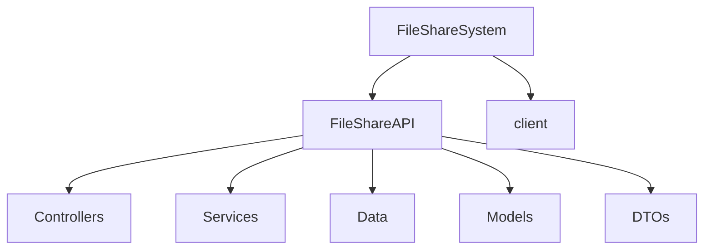
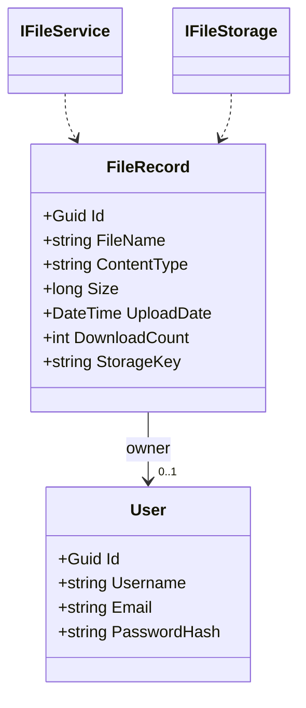

# FileShareSystem

<p align="center">
  
  
  
  
</p>

A small, practical file-sharing app with an ASP.NET Core API backend and a React + Vite frontend. Upload files, browse metadata, download files, and track download counts.

**What it does**
- Upload files through the API and store them on disk.
- Persist file metadata in PostgreSQL using Entity Framework Core.
- Present a simple frontend with file cards, metadata, and download/delete actions.

**Stack**
- Backend: ASP.NET Core Web API, Entity Framework Core, PostgreSQL, Swagger
- Frontend: React 19, Vite, Axios, Tailwind CSS
- Storage: Local filesystem for uploaded files (backend `Storage/uploads/`)

**Project layout**

```text
FileShareSystem/
├─ FileShareAPI/        # ASP.NET Core backend (controllers, services, EF migrations)
└─ client/              # React + Vite frontend
```

**Quick Start**

Prerequisites: `.NET 10 SDK`, `Node.js 18+`, `PostgreSQL 15+`.

Backend (API):

```bash
cd FileShareAPI
dotnet restore
dotnet ef database update
dotnet run
```

Frontend (client):

```bash
cd client
npm install
npm run dev
```

Configure the frontend base URL by creating `client/.env` with:

```env
VITE_BACKEND_URL=https://localhost:7261
```

See `client/.env.example` for an example.

**API (important endpoints)**
- `GET /api/file/test` — health check
- `POST /api/file` — upload a file (multipart/form-data)
- `GET /api/file` — list files (metadata)
- `GET /api/file/{id}` — get file record
- `GET /download/{id}` — download stored file
- `DELETE /api/file/{id}` — delete file and record

**Architecture & File UML**

Below is a compact view of the repository and a small class diagram showing core domain models. Use these to quickly reason about where code lives and what the main entities are.





Notes:
- `StorageKey` is the filename/path used by the storage provider (`LocalFileStorage` by default).
- The codebase keeps controllers thin; business logic lives in `Services/` and persistence in `Data/ApplicationDbContext.cs`.

**Migrations & Database**
- Migrations live under `FileShareAPI/Migrations/`. Run `dotnet ef database update` to apply them.
- The default connection is configured in `appsettings.Development.json`.

**Development tips**
- Use Swagger (when running the API in Development) to exercise endpoints quickly: `https://localhost:<port>/swagger`.
- If HTTPS ports differ between backend and frontend, update `VITE_BACKEND_URL`.

**Where to look first (recommended files)**
- Backend: `FileShareAPI/Controllers/FileController.cs`, `FileShareAPI/Services/FileSevice.cs`, `FileShareAPI/Services/LocalFileStorage.cs`
- Frontend: `client/src/pages/FilesPage.jsx`, `client/src/lib/api.js`, `client/src/components/Card.jsx`

---

If you'd like, I can also: add a PNG export of the UML, expand the architecture section with sequence diagrams, or update `client/.env.example` and a `README.client.md` for developer onboarding. Which would you prefer next?
